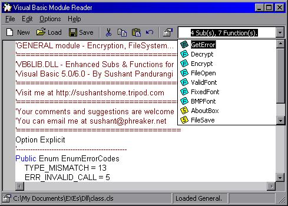



## VB module reader: goes to definition, colour coding, \.\.\. Neat\!

### Description

OK, after some messy submissions, I'm glad to present to you the submission of a lifetime. Updated 22 apr, This app will list every function and sub in any module you open, It will get the name of the module, show file information about the module, highlight syntax in colour, etc. The interface is worked out nicely and its quite neat. It can even go to the definition of a particular word. Identifies comments as well. You can do almost everything that is done within the IDE. All in All, a good peice of thing that you might not use actually INSTEAD of the VB IDE, but worth a try definitely. What more can this description say, check out the screenshot.
 
### More Info
 

             |
---                |---
**Submitted On**   |2001-04-20 14:41:08
**By**             |[sushpa](https://github.com/Planet-Source-Code/PSCIndex/blob/master/ByAuthor/sushpa.md)
**Level**          |Intermediate
**User Rating**    |4.2 (25 globes from 6 users)
**Compatibility**  |VB 5\.0, VB 6\.0
**Category**       |[Complete Applications](https://github.com/Planet-Source-Code/PSCIndex/blob/master/ByCategory/complete-applications__1-27.md)
**World**          |[Visual Basic](https://github.com/Planet-Source-Code/PSCIndex/blob/master/ByWorld/visual-basic.md)
**Archive File**   |[VB module 186674222001\.zip](https://github.com/Planet-Source-Code/sushpa-vb-module-reader-goes-to-definition-colour-coding-neat__1-22518/archive/master.zip)

